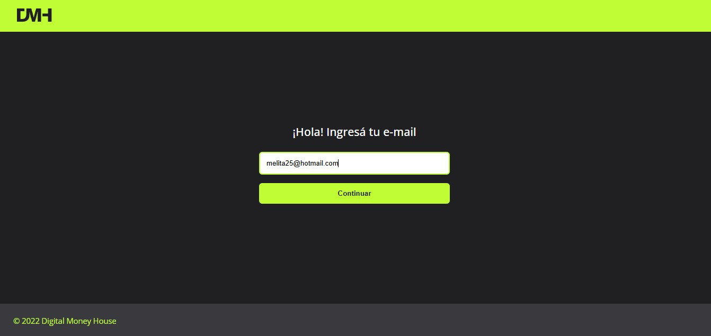
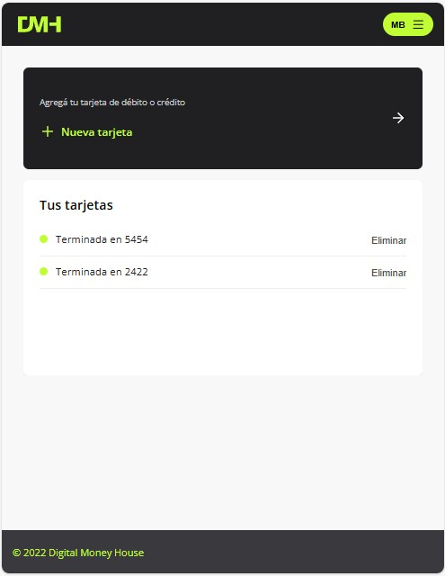

# 💸 Digital Money House

Proyecto final de la carrera Certified Tech Developer - Especialización Frontend (Digital House)

---

## 🔍 Descripción General

Digital Money House es una billetera virtual desarrollada con Next.js y TypeScript, que permite a los usuarios gestionar su dinero de forma intuitiva y segura. Incluye funcionalidades de registro/login, visualización de CVU y alias, carga de dinero con tarjetas, transferencias, gestión de tarjetas, pagos de servicios y visualización de actividad.

Este proyecto fue desarrollado en equipo simulando un entorno de trabajo real con metodología Scrum, Trello para la organización y despliegue en Vercel y EC2 con Docker.

---

## ⚖️ Tecnologías utilizadas

- Frontend: Next.js, React, TypeScript, Styled Components

- Estado global: Jotai, React Context

- Data Fetching: React Query (Query + Mutation)

- UI/UX: React Toastify, react-credit-cards-2, framer-motion

- Tests: Testing Library, Jest (Manual + Automatizados con Selenium)

- Docker & Deployment: Docker, Docker Compose, Vercel, Amazon EC2

- Otras: ESLint, Prettier, GitHub Actions

- [Next.js](https://nextjs.org/)
- [React](https://reactjs.org/)
- [Styled Components](https://styled-components.com/)
- [TypeScript](https://www.typescriptlang.org/)
- [PNPM](https://pnpm.io/) (gestor de paquetes)

---

## ⚙️ Arquitectura y Patrones

- Hooks personalizados: para lógica de negocio desacoplada

- React Context + Jotai: para gestión eficiente del estado global (como MoneyLoadContext, tokenAtom, etc.)

- React Query: para manejo asincrónico de datos con Query y Mutation

- Atomic Design: los componentes fueron organizados siguiendo principios de reusabilidad y escalabilidad

## 📦 Requisitos previos

Antes de clonar este repositorio, asegurate de tener instalado:

- Node.js (v18 o superior recomendado)
- [PNPM](https://pnpm.io/installation)

---

## 🧑‍💻 Instalación local

1. **Cloná el repositorio:**

   ```bash
   git clone https://github.com/tu-usuario/digital-money-house.git
   cd digital-money-house

   Instalá las dependencias:
   pnpm install

   Iniciá el servidor de desarrollo:
   pnpm dev

   Abrí el navegador en http://localhost:3000

## ☕ Versión Dockerizada

1. **Docker:**

   ```bash
   docker-compose build
   docker-compose up

   La app estará disponible en: http://localhost:3000

## 🚀 Despliegue

- Vercel: https://digital-money-juan-manuel-herrero.vercel.app/

- Amazon EC2 con Docker: (configurable según entorno del equipo)

## 📅 Organización del Proyecto

- Trello con historias de usuario y tareas por sprint:
[Trello Board](https://trello.com/invite/b/6828b364070297021d4dd856/ATTI8580e85159b160d54898d14b2c4577582B9ACF73/digital-money)

- Planificación y epics: Sprint 1 (registro/login/dashboard), Sprint 2 (tarjetas), Sprint 3 (carga de dinero y pagos), Sprint 4 (pago de servicios)

## 📊 Tests Realizados

- Smoke tests y regresión manual documentados en planillas

- Tests automáticos: Selenium con Java y JUnit para flujos de registro, login y carga de tarjeta. Repositorio disponible en [GitLab](https://gitlab.com/juanmanuelherrero281991-group/selenium-digitalmoney-tests)

- Cobertura de errores, validaciones y feedback con Toastify

## 📷 Capturas / Demo

A continuación se presentan capturas de las secciones clave de la aplicación:

Login:




Dashboard:


Carga de Dinero:





Actividad:


Pagos de Servicios:


## ✍️ Autor / Equipo

Juan Manuel Herrero - TL Frontend, UX/UI Ref. 
[GitHub](https://github.com/JuanHerrero28) | [LinkedIn](https://www.linkedin.com/in/juan-manuel-herrero/)

## 🚩 Notas finales

- Este proyecto representa el cierre de un camino de formación y crecimiento profesional. Fue construido con pasión, metodología y las mejores prácticas de desarrollo frontend. ¡Gracias por visitarlo!


